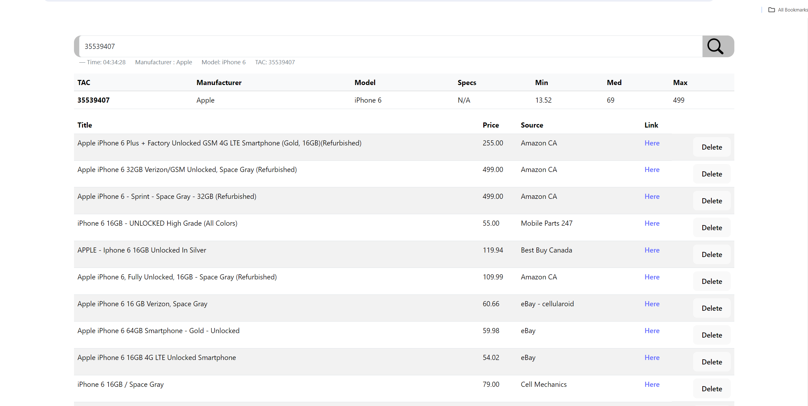
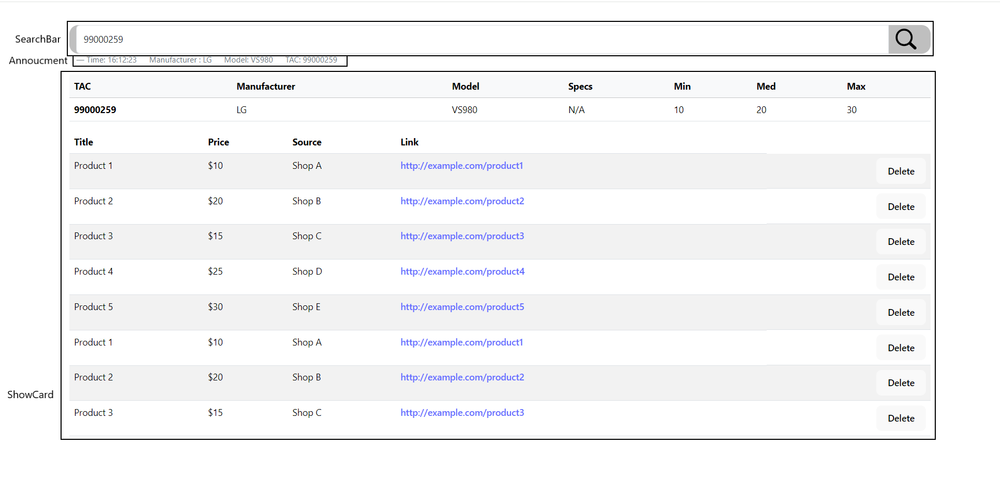
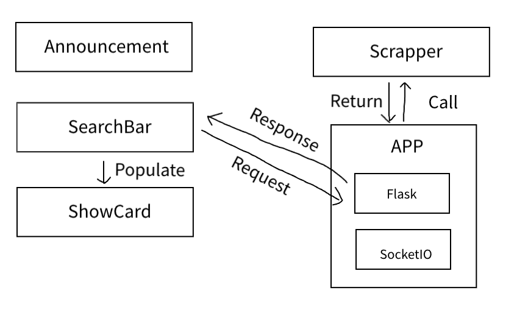
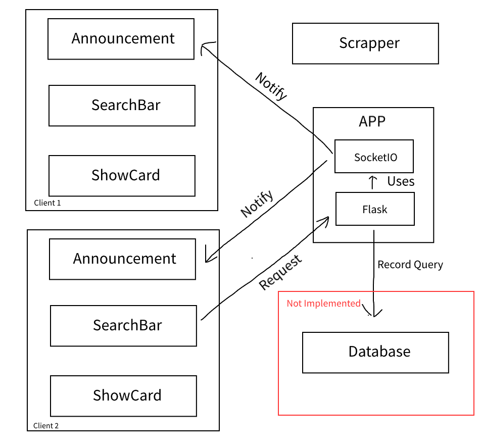
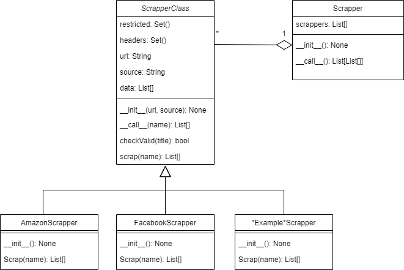

# TAC Price Scrapper
This project involves a website scraper designed to retrieve price information based on the [Type Allocation Code (TAC)](https://en.wikipedia.org/wiki/Type_Allocation_Code#:~:text=The%20Type%20Allocation%20Code%20TAC,to%20uniquely%20identify%20wireless%20devices) of a device. It then presents this data in a visualized format.

> [!NOTE]
> This project utilizes a .csv database sourced online, implying that the data may be obsolete. (Utilizing a RealTime API would incur excessive costs.)

## Demo


### Hosting
This project is not hosted, because the free tier from pythonanywhere doesn't support `requests` library unless upgrade ([Details](https://www.pythonanywhere.com/forums/topic/14657/)). If you (viewer) is bale to find a free backend hosting service that supports `requests` for HTTP connection, please let me know.

## Running Frontend

```bash
cd frontend
npm install
npm run dev
```

## Running Backend

```bash
cd backend
pip install -r requirements.txt
python -m flask --app app.py --debug run
```

## Project Structure
### FrontEnd

#### Search

#### Annoucments


### BackEnd
#### API Calls
Default Host: 127.0.0.1:5000 - Modify form `frontend\src\config.js`

This request returns "Hello World"
```url
127.0.0.1:5000
```

This request returns a json file which contains: tac, manufacturer, name, contributor, comment, gsmarena, gsmarena1,aka.
```url
127.0.0.1:5000/get?param=$tac$
```

This request returns a json file which contains all the scrapped data: title, price, source, link. 
```url
127.0.0.1:5000/fetch?param=$name$
```

#### Scrapper


### Todos
- [ ] More Scrappers?